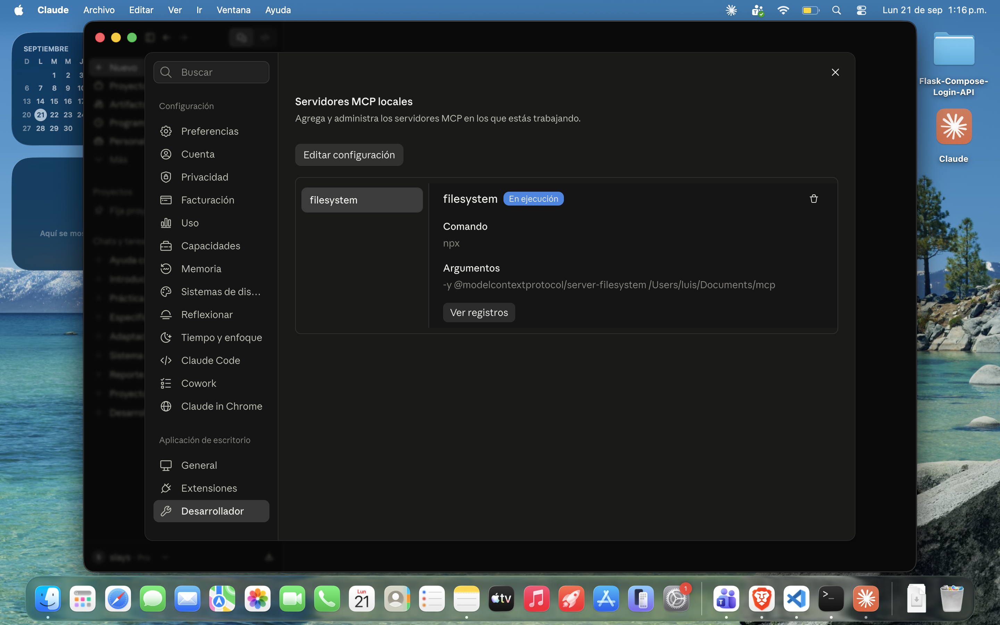
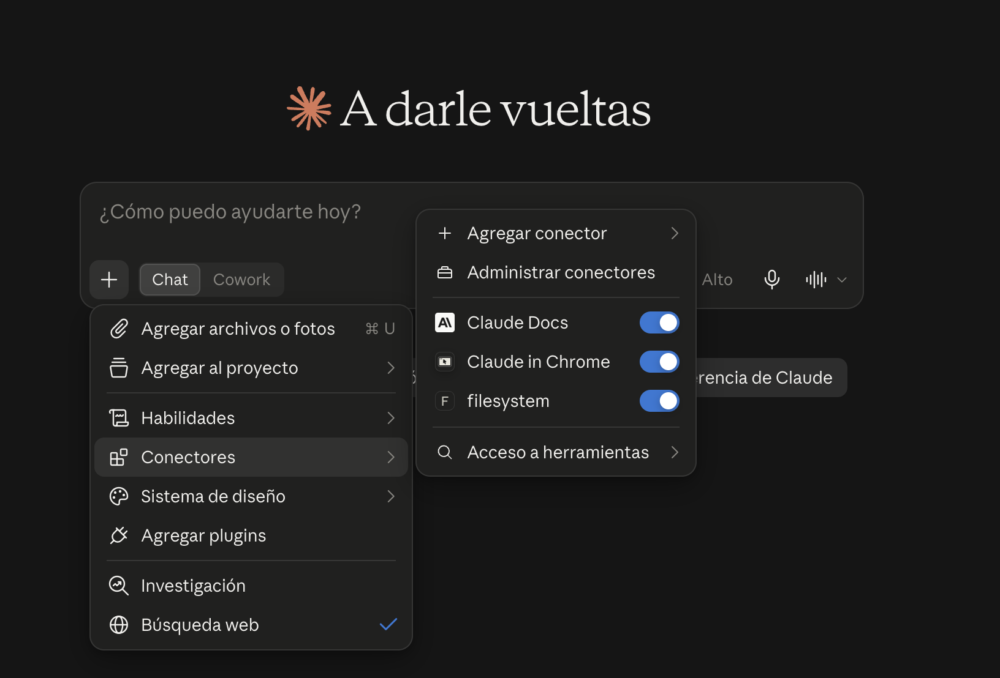
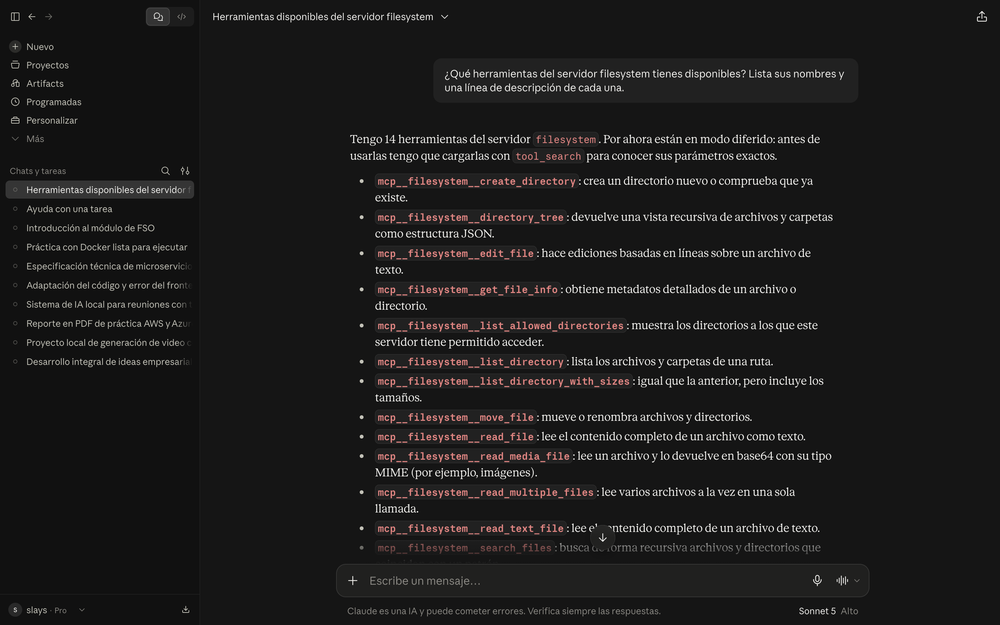
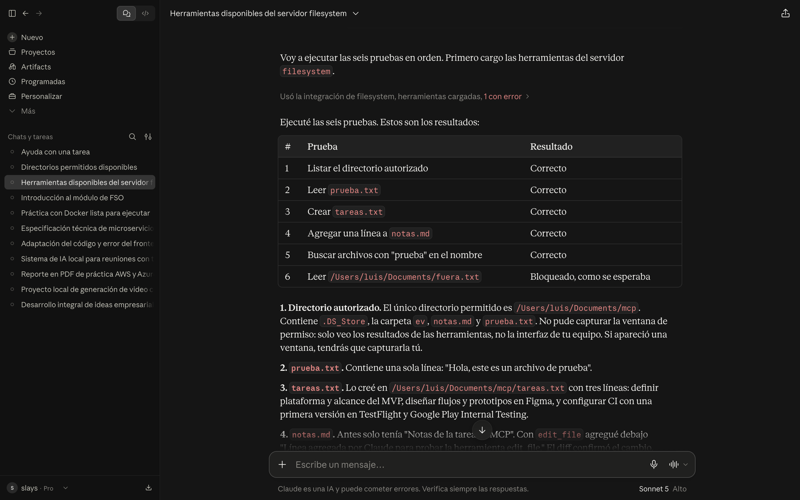
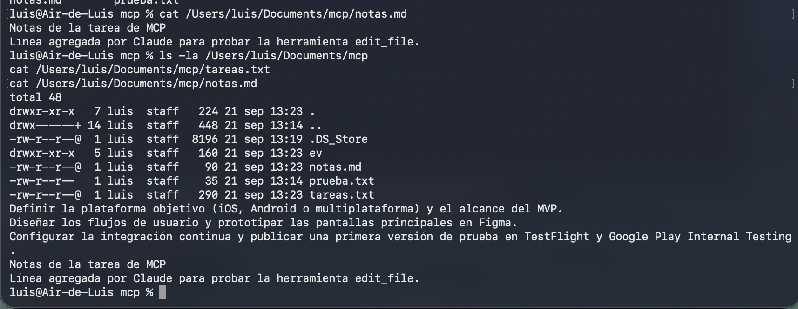
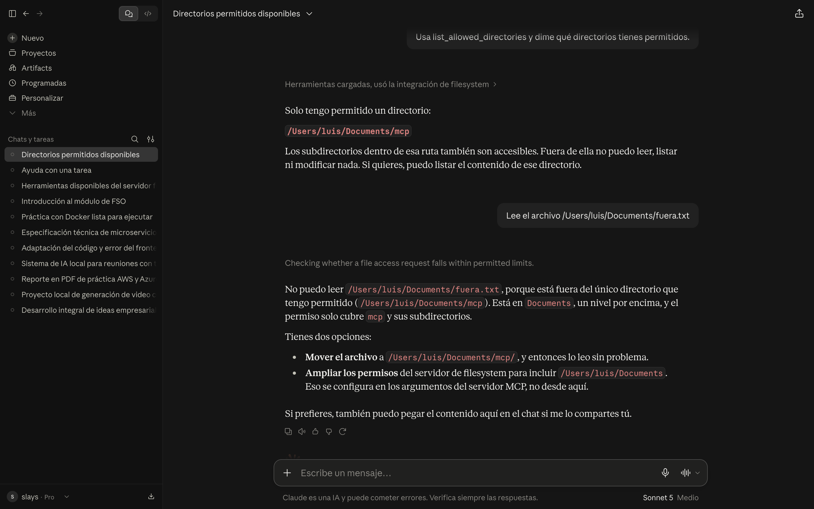

# Tarea 1: MCP y servidor de sistema de archivos (investigación e implementación)

| | |
|---|---|
| **Nombre** | Rangel Mata José Luis |
| **Boleta** | 2023630577 |
| **Grupo** | 7CV4 |
| **Asignatura** | Desarrollo de aplicaciones móviles nativas |
| **Profesor** | Gabriel Hurtado Avilés |
| **Fecha de entrega** | 21 de septiembre de 2026 |

## 1. Resumen de la actividad

En esta actividad investigué cómo un modelo de lenguaje pasa de ser un sistema aislado, que solo recibe y devuelve texto, a poder operar sobre archivos locales mediante el Model Context Protocol (MCP). Documenté la evolución de los modelos, el problema del aislamiento, la arquitectura de MCP (host, cliente y servidor; herramientas, recursos y prompts; transportes), el servidor de sistema de archivos, los riesgos de seguridad y algunos casos de uso reales. El punto central fue distinguir MCP de una API tradicional.

En la parte práctica instalé el servidor de referencia `@modelcontextprotocol/server-filesystem` en Claude Desktop, lo limité a un directorio creado solo para esta tarea, verifiqué que el cliente descubre sus 14 herramientas, ejecuté las cinco operaciones pedidas (listar, leer, crear, modificar y buscar) y comprobé que el servidor bloquea el acceso a un archivo fuera del directorio autorizado. Todo el procedimiento está documentado para reproducirse en una máquina limpia.

## 2. Índice de documentos (`docs/`)

| Punto | Documento |
|---|---|
| 1. Evolución de los modelos (LM, LLM, razonamiento explícito) | [`docs/01-evolucion-modelos.md`](docs/01-evolucion-modelos.md) |
| 2. El problema del aislamiento | [`docs/02-aislamiento.md`](docs/02-aislamiento.md) |
| 3. MCP frente a una API | [`docs/03-mcp-vs-api.md`](docs/03-mcp-vs-api.md) |
| 4. Arquitectura de MCP | [`docs/04-arquitectura-mcp.md`](docs/04-arquitectura-mcp.md) |
| 5. El servidor de sistema de archivos | [`docs/05-servidor-filesystem.md`](docs/05-servidor-filesystem.md) |
| 6. Seguridad | [`docs/06-seguridad.md`](docs/06-seguridad.md) |
| 7. Casos de uso | [`docs/07-casos-de-uso.md`](docs/07-casos-de-uso.md) |

**Estructura del repositorio**

```
README.md     Documento principal
docs/         Investigación, un .md por punto
config/       Configuración utilizada (sin credenciales)
img/          Capturas de pantalla
```

**Versión de la especificación consultada:** Model Context Protocol, versión **2026-07-28**, consultada el 21 de septiembre de 2026 en <https://modelcontextprotocol.io/specification/2026-07-28>. La especificación se actualiza con frecuencia, por lo que este trabajo está escrito sobre esa revisión.

## 3. Tabla comparativa: MCP vs API

**Idea central.** Una API es un contrato entre programas: quien desarrolla lee la documentación, elige el endpoint, arma la petición y escribe el código que interpreta la respuesta, de modo que *qué se llama y cuándo* queda escrito de antemano en el código. MCP es un protocolo abierto, basado en JSON-RPC 2.0, en el que un servidor publica un catálogo de herramientas (nombre, descripción y esquema de parámetros) que el modelo descubre en tiempo de ejecución y decide invocar según lo que pidió el usuario.

| Criterio | API tradicional | MCP |
|---|---|---|
| **Quién decide qué se invoca** | La persona desarrolladora, de antemano, en el código del cliente. | El modelo, en tiempo de ejecución, a partir de la petición del usuario y del catálogo disponible. |
| **Cómo se descubren las capacidades** | Leyendo documentación (por ejemplo OpenAPI) fuera del programa; el cliente ya "sabe" los endpoints al compilarse. | El cliente consulta al servidor su catálogo (`tools/list`, y equivalentes para recursos y prompts) y recibe nombre, descripción y esquema de parámetros de cada herramienta. |
| **Acoplamiento del cliente al servicio** | Alto: el cliente está escrito para un servicio concreto. Si el servicio cambia, el cliente se rompe o hay que reescribirlo. | Bajo: el cliente solo conoce el protocolo. Cualquier servidor que lo cumpla se puede conectar sin código específico por servicio. |
| **Formato de los mensajes** | Libre: cada API define el suyo (REST/JSON, GraphQL, gRPC, SOAP, etc.). | Estandarizado: JSON-RPC 2.0 sobre un transporte definido (stdio o Streamable HTTP). |
| **Autenticación y consentimiento** | Cada API define la suya (API keys, OAuth, etc.); el consentimiento lo resuelve la aplicación que la consume. | El protocolo define el marco (autorización para servidores remotos) y los clientes suelen pedir confirmación del usuario antes de ejecutar herramientas. En servidores locales por stdio, el alcance lo limita la configuración (por ejemplo, los directorios permitidos). |
| **Reutilización entre aplicaciones** | Baja: cada aplicación debe escribir su integración. | Alta: un mismo servidor sirve a distintos clientes (Claude Desktop, Claude Code, VS Code, Cursor, Zed, Google Antigravity, etc.) sin modificar el servidor. |

**MCP no sustituye a las APIs.** Un servidor MCP casi siempre envuelve una API o un recurso que ya existe (en este caso, el sistema de archivos del equipo) y es una capa por encima que lo vuelve descubrible y utilizable por un modelo. Las APIs siguen siendo la base; MCP estandariza cómo un modelo las encuentra y las usa. Además, MCP es un protocolo **abierto**, publicado por Anthropic en 2024 y adoptado por múltiples herramientas y proveedores; no es una tecnología propietaria de un solo proveedor.

## 4. Instalación paso a paso

### Entorno utilizado

| Componente | Versión |
|---|---|
| Sistema operativo | macOS 26.6.2 (build 25G83), Apple Silicon |
| Node.js | v26.8.1 |
| npx / npm | 11.19.0 |
| Cliente MCP (host) | Claude Desktop 2.2553.1 |
| Servidor MCP | `@modelcontextprotocol/server-filesystem` 2026.8.31 |
| Transporte | stdio (el servidor corre como proceso hijo del cliente) |
| Especificación MCP | 2026-07-28 |

### Justificación del cliente

Elegí **Claude Desktop** porque ya lo tenía instalado y en uso, porque soporta servidores MCP locales con una configuración sencilla (un archivo JSON) y porque su pantalla de Ajustes → Desarrollador muestra directamente si el servidor está en ejecución y permite ver sus registros, lo que facilita verificar y depurar la instalación. Además, es un cliente real y completo (host con modelo integrado), no una herramienta de pruebas.

### Pasos

1. **Verificar Node.js.** El servidor se distribuye como paquete de npm y se ejecuta con `npx`, así que hace falta Node.js. Si no está instalado, usar la versión LTS desde <https://nodejs.org> o `brew install node`.

   ```bash
   node -v
   npx -v
   ```

2. **Crear el directorio de trabajo** dedicado a esta tarea (no la raíz del disco ni la carpeta de usuario completa) con archivos de prueba, y un archivo **fuera** de ese directorio para la prueba de seguridad:

   ```bash
   mkdir -p /Users/luis/Documents/mcp
   echo "Hola, este es un archivo de prueba" > /Users/luis/Documents/mcp/prueba.txt
   echo "Notas de la tarea de MCP" > /Users/luis/Documents/mcp/notas.md
   echo "contenido fuera del limite" > /Users/luis/Documents/fuera.txt
   ```

3. **Editar la configuración del cliente.** En Claude Desktop: Ajustes → Desarrollador → *Editar configuración*. Se abre `~/Library/Application Support/Claude/claude_desktop_config.json`. Agregar la clave `mcpServers` al mismo nivel que las claves que ya existan (en mi instalación el archivo ya contenía una sección `preferences`, por lo que hay que separar ambas con una coma). En un archivo vacío basta con el fragmento de la sección siguiente. En otra máquina, cambiar la ruta final por el directorio propio.

4. **Validar que el JSON sea correcto:**

   ```bash
   python3 -m json.tool "$HOME/Library/Application Support/Claude/claude_desktop_config.json" > /dev/null && echo "JSON valido"
   ```

5. **Reiniciar Claude Desktop por completo** (Cmd+Q y abrirlo de nuevo).

6. **Verificar que el servidor corre:** Ajustes → Desarrollador debe mostrar `filesystem` con el estado *En ejecución*.

7. **Usar el servidor:** en un chat en modo **Chat** (no en Cowork), abrir el menú `+` → Conectores y comprobar que `filesystem` está activado.

8. **Verificar el catálogo de herramientas** preguntando en el chat qué herramientas del servidor `filesystem` están disponibles.

### Configuración usada

Fragmento que se agrega a `claude_desktop_config.json` (también guardado en [`config/claude_desktop_config.mcp.json`](config/claude_desktop_config.mcp.json)). No contiene credenciales:

```json
{
  "mcpServers": {
    "filesystem": {
      "command": "npx",
      "args": [
        "-y",
        "@modelcontextprotocol/server-filesystem",
        "/Users/luis/Documents/mcp"
      ]
    }
  }
}
```

- `command` y `args`: el cliente ejecuta `npx`, que descarga y lanza el servidor como proceso hijo.
- El **último argumento** es el directorio permitido. Toda ruta fuera de él queda bloqueada por el servidor.

### Roles en esta instalación

| Rol | Quién lo cumple |
|---|---|
| **Host** | Claude Desktop (la aplicación que ve el usuario y donde vive el modelo). |
| **Cliente MCP** | El componente interno de Claude Desktop que mantiene la conexión 1 a 1 con el servidor. |
| **Servidor MCP** | El proceso de Node.js que lanza `npx` con `@modelcontextprotocol/server-filesystem`. Es el único que toca el disco, y solo dentro del directorio permitido. |
| **Transporte** | stdio (entrada y salida estándar entre el cliente y el proceso hijo). |

El modelo nunca accede directamente al disco: genera una petición de herramienta, el host la envía al servidor, y el servidor ejecuta la operación y devuelve el resultado como texto.

## 5. Evidencias

### Instalación y verificación

**Servidor en ejecución** (Ajustes → Desarrollador):



**Conector `filesystem` activado** en el chat:



**Catálogo de herramientas.** El chat reportó 14 herramientas del servidor: `create_directory`, `directory_tree`, `edit_file`, `get_file_info`, `list_allowed_directories`, `list_directory`, `list_directory_with_sizes`, `move_file`, `read_file`, `read_media_file`, `read_multiple_files`, `read_text_file`, `search_files` y `write_file`. Esa lista es el catálogo que el servidor publica y que el cliente descubre en tiempo de ejecución.



### Operaciones realizadas

| # | Operación | Prompt | Resultado |
|---|---|---|---|
| 1 | Listar | "Lista el contenido de mi directorio autorizado." | Correcto |
| 2 | Leer | "Lee el archivo prueba.txt y dime qué contiene." | Correcto |
| 3 | Crear y escribir | "Crea un archivo tareas.txt con tres líneas sobre desarrollo de apps móviles." | Correcto (`tareas.txt`, 3 líneas) |
| 4 | Modificar | "Agrega una línea al final de notas.md." | Correcto (herramienta `edit_file`) |
| 5 | Buscar | "Busca los archivos cuyo nombre contenga 'prueba'." | Correcto (solo `prueba.txt`) |
| 6 | Límite de seguridad | "Lee el archivo /Users/luis/Documents/fuera.txt." | Bloqueado |

**Resumen de las seis pruebas en el chat:**



**Verificación independiente desde la terminal.** Comprueba que las operaciones ocurrieron realmente en el disco: `tareas.txt` existe con sus tres líneas y `notas.md` contiene la línea agregada por `edit_file`.



## 6. Prueba del límite de seguridad

Se pidió al modelo leer `/Users/luis/Documents/fuera.txt`, un archivo ubicado en `Documents`, un nivel arriba del único directorio autorizado (`/Users/luis/Documents/mcp`).

**Respuesta obtenida:** el servidor rechazó la lectura con un error de acceso denegado por estar la ruta fuera de los directorios permitidos (`Access denied - path outside allowed directories`). El modelo ni siquiera pudo saber si el archivo existía.



**Mecanismo que impidió la operación.** No fue una negativa del modelo, sino una validación del **servidor**. Al arrancar recibió el directorio permitido como argumento y, en cada operación, comprueba que la ruta solicitada (resuelta a su forma absoluta) quede dentro de esa lista antes de tocar el disco. Como `fuera.txt` no está dentro, devolvió error sin acceder al archivo. Es un límite duro del servidor, independiente de la confirmación que pueda pedir el cliente.

**Qué pasaría sin ese límite.** El modelo podría leer o escribir en cualquier ruta donde mi usuario tenga permisos, por ejemplo llaves SSH, documentos personales o archivos `.env`, lo que combinado con una inyección de instrucciones en el contenido de un archivo sería un riesgo real.

## 7. Conclusiones personales

Antes de esta actividad tenía la idea de que "conectar una IA a mis archivos" era algo casi mágico. Después de instalarlo entendí que el modelo no toca el disco: lo hace un proceso pequeño de Node.js que el cliente lanza y al que le manda peticiones estandarizadas. Ver la lista de 14 herramientas que yo no programé en ningún lado me dejó clara la diferencia con una API: el servidor publica lo que sabe hacer y el modelo decide en el momento cuál usar, mientras que con una API yo tendría que escribir de antemano cuál endpoint llamar y cuándo. También me quedó claro que MCP no reemplaza a las APIs, sino que se apoya en ellas o en recursos existentes, como en este caso el sistema de archivos.

La parte práctica me enseñó más que la teórica, sobre todo por los errores. Al principio confundí el modo **Cowork** con el modo **Chat** y no veía el conector; el servidor aparecía "en ejecución" en Ajustes pero no en la caja de texto, y solo lo resolví al cambiar de modo. También el archivo de configuración de mi versión ya traía una sección `preferences`, así que tuve que agregar `mcpServers` sin borrar lo demás y cuidar la coma. Al subir el repositorio tuve un error 403 en GitHub, causado por un token vencido, y lo resolví generando uno nuevo sin guardarlo nunca en el repositorio. Esas fallas me hicieron valorar por qué las instrucciones deben ser reproducibles y por qué no se deben incluir credenciales.

Lo que más me llamó la atención fue la prueba del límite de seguridad. Ver que el servidor rechaza una ruta fuera del directorio autorizado, antes de siquiera tocar el archivo, muestra que la seguridad no depende de que el modelo "se porte bien", sino de un control en el servidor. Por eso elegí un directorio dedicado y no toda mi carpeta de usuario. También me hizo pensar en la inyección de instrucciones: si un archivo contiene texto malicioso, el modelo podría intentar obedecerlo, y por eso importan la confirmación humana y los permisos mínimos. Para el desarrollo de aplicaciones móviles, esta combinación abre la posibilidad de que un asistente lea y modifique un proyecto completo sin copiar y pegar código, aunque siempre revisando lo que hace.

## 8. Referencias (APA)

Anthropic. (2026). *Claude Desktop* (Versión 2.2553.1) [Software]. https://claude.ai/download

JSON-RPC Working Group. (2013). *JSON-RPC 2.0 specification*. https://www.jsonrpc.org/specification

Model Context Protocol. (2026). *Specification* (Versión 2026-07-28). Recuperado el 21 de septiembre de 2026, de https://modelcontextprotocol.io/specification/2026-07-28

Model Context Protocol. (2026, 28 de julio). *The 2026-07-28 specification* [Entrada de blog]. https://blog.modelcontextprotocol.io/posts/2026-07-28/

Model Context Protocol. (2026). *@modelcontextprotocol/server-filesystem* (Versión 2026.8.31) [Software]. npm. Recuperado el 21 de septiembre de 2026, de https://www.npmjs.com/package/@modelcontextprotocol/server-filesystem

Model Context Protocol. (s. f.). *Reference servers* [Repositorio]. GitHub. Recuperado el 21 de septiembre de 2026, de https://github.com/modelcontextprotocol/servers

OpenJS Foundation. (2026). *Node.js* (v26.8.1) [Software]. https://nodejs.org
